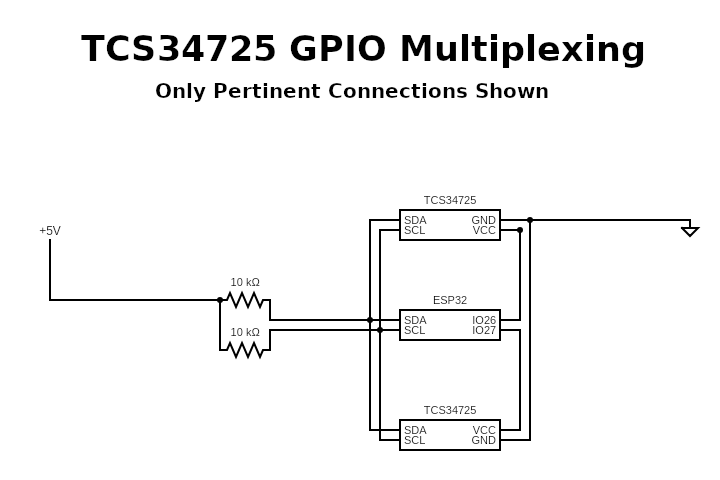

# TCS34725 Multiplexing with GPIO
---
## Description
This is an arduino program that I used to experiment with multiplexing 2 TCS34725 sensors
using GPIO pins along with a circuit diagram describing the (pertinent) connections that
I made.  The sensor datasheet says that the sensor only pulls ~300 microamps so I felt that
driving the sensor directly from the GPIO pin was safe.  I played around with the delay to
allow time for the sensor to startup before starting to communicate with it and landed on
a delay of 5 microseconds which seemed stable for my circuit.. you may need to experiment
with this timing for yourself.

## Circuit Diagram

